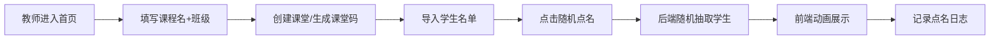
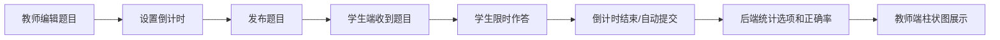

## 1. 产品概述

课堂教学互动工具是一款面向K12及高等教育场景的实时互动教学平台，旨在提升课堂参与度、活跃课堂氛围、便捷教学互动。
- 主要目的：解决传统课堂中学生参与度低、互动形式单一、答题统计困难等问题
- 目标用户：教师（主讲端）和学生（参与端）
- 产品价值：通过游戏化的随机点名、实时答题互动，让课堂更生动，让学情数据可视化

## 2. 核心功能

### 2.1 用户角色

| 角色 | 进入方式 | 核心权限 |
|------|----------|----------|
| 教师 | 直接进入教师端 | 创建课堂、导入学生、发布题目、随机点名、查看统计 |
| 学生 | 输入课堂码加入 | 加入课堂、参与答题、被点到名时响应 |

### 2.2 功能模块

1. **课堂管理（教师端）**：创建课堂、输入课程名与班级、生成课堂码、课堂状态管理
2. **学生管理（教师端）**：Excel导入名单、手动添加学生、学生列表展示、头像设置
3. **随机点名（双端）**：教师发起随机点名、前端动画展示、点名日志记录
4. **答题互动（双端）**：教师发布选择题/判断题、学生限时作答、倒计时自动提交、实时统计
5. **数据统计（教师端）**：点名日志、答题正确率、柱状图展示、投屏模式

### 2.3 页面详情

| 页面名称 | 模块名称 | 功能描述 |
|-----------|-------------|---------------------|
| 教师首页 | 课堂创建卡片 | 输入课程名、班级，创建课堂并生成6位课堂码 |
| 教师首页 | 课堂历史列表 | 展示历史创建的课堂，可继续进入或删除 |
| 课堂控制台（教师） | 学生管理面板 | Excel导入、手动添加、列表展示、头像预览 |
| 课堂控制台（教师） | 随机点名模块 | 大按钮发起点名、姓名+头像动画展示区、点名日志列表 |
| 课堂控制台（教师） | 答题发布模块 | 题型选择（单选/判断）、题目编辑、选项设置、倒计时设置、发布按钮 |
| 课堂控制台（教师） | 统计展示区 | 柱状图实时展示各选项人数、正确率显示、投屏全屏按钮 |
| 学生加入页 | 课堂码输入 | 6位课堂码输入框、姓名输入（首次加入）、加入按钮 |
| 学生课堂页 | 等待状态 | 显示课程信息、教师、在线人数 |
| 学生课堂页 | 点名展示 | 被点到时全屏高亮动画展示 |
| 学生课堂页 | 答题面板 | 题目展示、选项点击、倒计时进度条、自动提交 |

## 3. 核心流程

### 3.1 教师创建课堂与随机点名流程

教师进入首页 → 填写课程名和班级 → 创建课堂 → 生成课堂码 → 导入学生名单（Excel/手动）→ 点击「随机点名」→ 后端随机抽取学生 → 前端动画展示姓名和头像 → 记录点名日志 → 循环使用

### 3.2 答题互动流程

教师编辑题目（选择题/判断题）→ 设置倒计时 → 发布题目 → 学生端实时收到题目 → 学生限时作答 → 倒计时结束自动提交 → 后端统计各选项人数和正确率 → 教师端柱状图实时展示

## 4. 用户界面设计

### 4.1 设计风格

- **主色调**：深海蓝（#1E3A5F）+ 活力橙（#FF6B35），传达专业教育与活跃互动的双重气质
- **辅助色**：薄荷绿（#3ECF8E）正确、珊瑚红（#FF6B6B）错误、晴空蓝（#4ECDC4）中性
- **按钮风格**：圆润大按钮（圆角16px），渐变背景，悬停上浮效果+发光阴影
- **字体**：标题使用「思源黑体Bold」/「阿里巴巴普惠体Heavy」，正文使用「思源黑体Regular」，数据展示使用「JetBrains Mono」
- **布局风格**：卡片式分区布局，顶部固定导航，左侧功能区+右侧大屏展示区（教师端）
- **图标/表情**：使用线性+填充混合图标，关键操作辅以Emoji增强亲切感（🎯📝✨）

### 4.2 页面设计概览

| 页面名称 | 模块名称 | UI元素 |
|-----------|-------------|-------------|
| 教师首页 | 创建课堂区 | 大号输入卡片、渐变创建按钮、悬浮课堂码展示弹层 |
| 课堂控制台（教师） | 随机点名区 | 超大圆形按钮（带脉冲光环）、中央姓名展示舞台（玻璃拟态+光晕）、滚动式点名动画、日志时间轴 |
| 课堂控制台（教师） | 答题统计区 | 动态柱状图（柱子增长动画）、实时数字跳动、正确率环形进度、全屏投屏遮罩 |
| 学生课堂页 | 等待/互动区 | 课程信息卡、在线人数气泡、点名通知冲击波动画、答题卡片翻转效果 |
| 学生课堂页 | 答题面板 | 选项卡片（点击水波反馈）、顶部倒计时进度条（颜色渐变警示）、提交成功动画 |

### 4.3 响应式设计

- **Desktop-first**：教师端以桌面端为主（≥1440px），采用双栏或三栏大屏布局
- **学生端自适应**：学生端需适配手机（≤768px）和Pad端，触控区域≥48px
- **投屏优化**：教师端提供投屏模式（F11全屏适配），柱状图和文字放大200%，对比度增强

### 4.4 动画与交互亮点

- **点名动画**：姓名快速滚动（老虎机效果）→ 减速停住 → 头像圆形放大+光环脉冲 → 全屏彩屑飘落
- **答题统计**：柱状图从0开始弹性增长，数字滚动累加，正确率圆环渐进式填充
- **倒计时警示**：最后10秒进度条从绿→黄→红渐变，数字闪烁+心跳动画
- **课堂码展示**：6位数字分段放大展示，配合复制按钮+二维码
