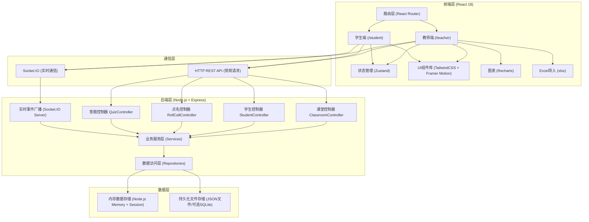
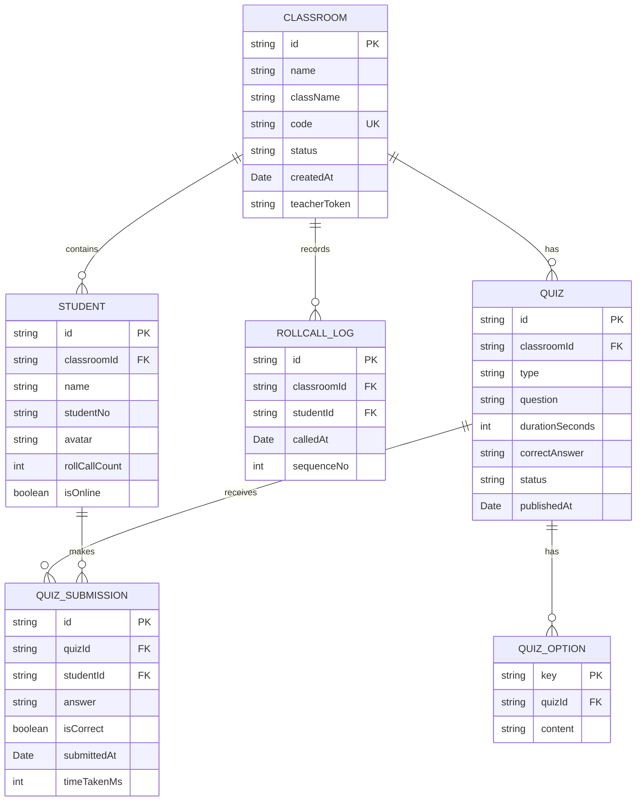
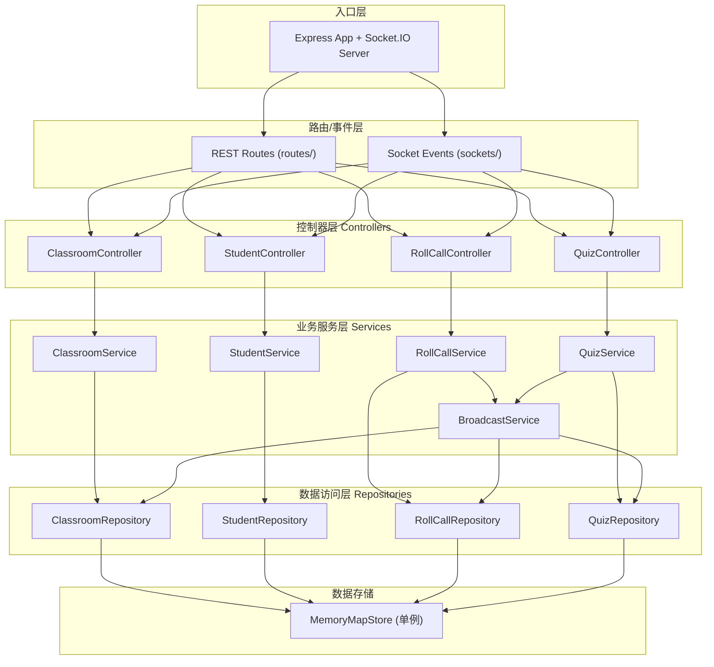

## 1. 架构设计



## 2. 技术选型说明

### 2.1 前端技术栈
- **核心框架**：React 18 + TypeScript
- **构建工具**：Vite（极速开发体验）
- **样式方案**：TailwindCSS 3（原子化CSS）+ CSS Variables（主题系统）
- **状态管理**：Zustand（轻量级、低样板代码）
- **路由**：React Router v6
- **动画**：Framer Motion（声明式动画，复杂交互动画利器）
- **图表**：Recharts（基于React/D3的柱状图/饼图）
- **Excel处理**：xlsx (SheetJS)
- **实时通信**：socket.io-client

### 2.2 后端技术栈
- **核心框架**：Node.js + Express 4
- **语言**：TypeScript
- **实时通信**：Socket.IO
- **数据存储**：
  - 运行时：内存存储（Map结构，适合单实例演示场景）
  - 可选持久化：JSON文件 / better-sqlite3
- **跨域**：cors中间件

### 2.3 目录结构约定
```
solo6-140/
├── server/                    # 后端服务
│   ├── src/
│   │   ├── controllers/       # 控制器层（接口处理）
│   │   ├── services/          # 业务服务层（核心逻辑）
│   │   ├── repositories/      # 数据访问层
│   │   ├── models/            # 类型定义
│   │   ├── routes/            # 路由定义
│   │   ├── middleware/        # 中间件
│   │   ├── sockets/           # Socket.IO事件处理
│   │   ├── utils/             # 工具函数
│   │   └── index.ts           # 入口
│   └── package.json
│
├── client/                    # 前端应用
│   ├── src/
│   │   ├── pages/             # 页面级组件
│   │   │   ├── teacher/       # 教师端页面
│   │   │   └── student/       # 学生端页面
│   │   ├── components/        # 可复用组件
│   │   │   ├── teacher/       # 教师端组件
│   │   │   └── student/       # 学生端组件
│   │   ├── stores/            # Zustand状态管理
│   │   ├── hooks/             # 自定义Hooks
│   │   ├── services/          # API请求封装
│   │   ├── sockets/           # Socket.IO客户端封装
│   │   ├── utils/             # 工具函数
│   │   ├── types/             # TypeScript类型定义
│   │   ├── styles/            # 全局样式
│   │   ├── App.tsx
│   │   └── main.tsx
│   └── package.json
│
└── package.json               # 根monorepo管理
```

## 3. 路由定义

### 3.1 前端路由
| 路由 | 用途 | 权限 |
|-------|---------|------|
| `/` | 首页入口，角色选择（教师/学生） | 公开 |
| `/teacher` | 教师首页 - 课堂管理/创建 | 教师 |
| `/teacher/classroom/:classroomId` | 教师课堂控制台 | 教师 |
| `/student` | 学生加入页 - 输入课堂码 | 学生 |
| `/student/classroom/:classroomId` | 学生课堂主页 | 学生（已加入） |

### 3.2 后端 REST API
| Method | Route | Purpose |
|--------|-------|---------|
| POST | `/api/classrooms` | 创建课堂 |
| GET | `/api/classrooms/:classroomId` | 获取课堂详情 |
| GET | `/api/classrooms/code/:code` | 通过课堂码获取课堂 |
| POST | `/api/classrooms/:classroomId/students` | 手动添加学生 |
| POST | `/api/classrooms/:classroomId/students/import` | Excel批量导入学生 |
| GET | `/api/classrooms/:classroomId/students` | 获取学生列表 |
| DELETE | `/api/classrooms/:classroomId/students/:studentId` | 删除学生 |
| POST | `/api/classrooms/:classroomId/rollcall` | 发起随机点名 |
| GET | `/api/classrooms/:classroomId/rollcall/logs` | 获取点名日志 |
| POST | `/api/classrooms/:classroomId/quizzes` | 发布题目 |
| GET | `/api/classrooms/:classroomId/quizzes/current` | 获取当前进行中的题目 |
| POST | `/api/classrooms/:classroomId/quizzes/submit` | 提交答题 |
| GET | `/api/classrooms/:classroomId/quizzes/stats` | 获取答题统计 |

### 3.3 Socket.IO 实时事件
| 事件名 | 发送方 | 接收方 | 说明 |
|--------|--------|--------|------|
| `teacher:join` | 教师端 | 服务端 | 教师加入课堂房间 |
| `student:join` | 学生端 | 服务端 | 学生加入课堂，携带学生ID |
| `rollcall:start` | 服务端 | 全部 | 广播随机点名开始 |
| `rollcall:result` | 服务端 | 全部 | 广播点名结果（被点学生ID） |
| `quiz:published` | 服务端 | 学生端 | 广播新题目发布 |
| `quiz:answer` | 学生端 | 服务端 | 学生提交答案（同步+广播） |
| `quiz:update` | 服务端 | 教师端 | 实时更新答题统计 |
| `quiz:finished` | 服务端 | 全部 | 答题结束+最终统计 |

## 4. 核心数据模型



## 5. 后端分层架构



## 6. 核心算法与逻辑

### 6.1 随机点名算法（公平加权）
```typescript
// 核心思路：被点次数越少，权重越高，避免重复点名
function pickRandomStudent(students: Student[]): Student {
  // 1. 计算基础权重 = (最大点名次数 - 当前点名次数 + 1)
  const maxCount = Math.max(...students.map(s => s.rollCallCount));
  const weighted = students.map(s => ({
    student: s,
    weight: Math.pow(maxCount - s.rollCallCount + 1, 2)  // 平方拉大差距
  }));
  
  // 2. 加权随机抽取
  const totalWeight = weighted.reduce((sum, w) => sum + w.weight, 0);
  let random = Math.random() * totalWeight;
  for (const item of weighted) {
    random -= item.weight;
    if (random <= 0) return item.student;
  }
  return weighted[weighted.length - 1].student;
}
```

### 6.2 课堂码生成
```typescript
// 生成6位数字+大写字母组合（排除易混淆字符0O1I）
function generateClassroomCode(): string {
  const chars = 'ABCDEFGHJKLMNPQRSTUVWXYZ23456789';
  let code = '';
  for (let i = 0; i < 6; i++) {
    code += chars.charAt(Math.floor(Math.random() * chars.length));
  }
  return code;
}
```

### 6.3 答题倒计时与自动提交
- 教师发布题目时设置 `durationSeconds`
- 服务端启动 `setTimeout`，到期自动切换状态为 `finished`
- 学生端同步倒计时（基于服务器时间偏差校准）
- 超时未答学生自动记录为未提交（不计入正确率分母，可配置）
